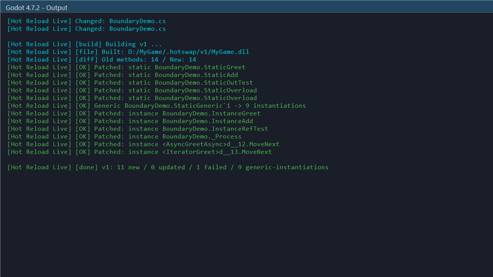
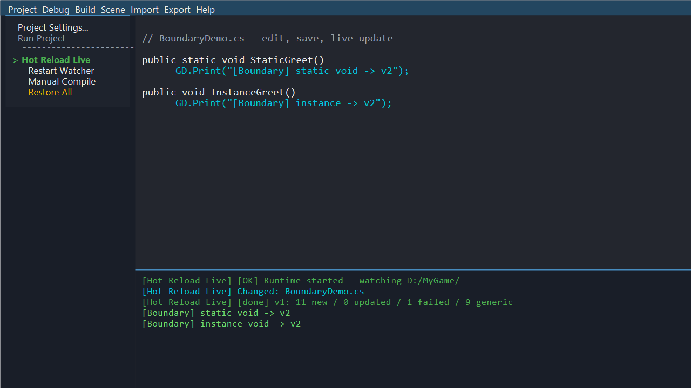
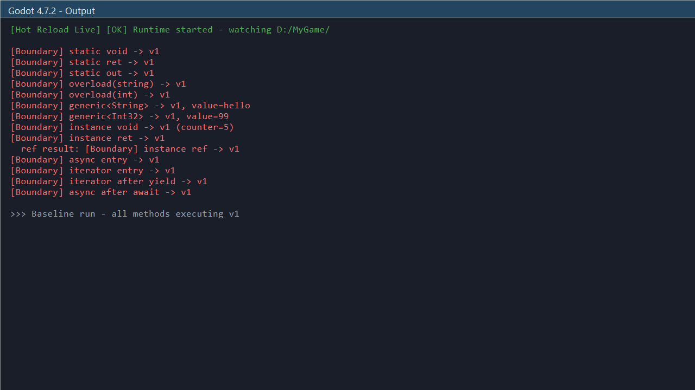
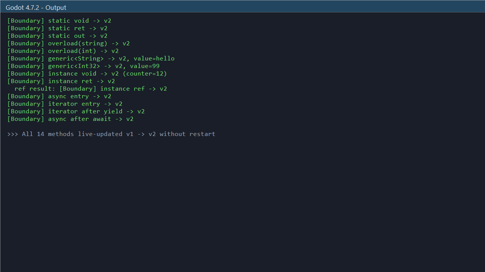

# Hot Reload Live for Godot

<p align="center">
  <b>Save a <code>.cs</code> file — watch it run.</b><br>
  No restart. No domain reload. Zero stuttering.
</p>

<p align="center">
  
  
  
  <a href="https://gutian2000.itch.io/hot-reload-live">
    
  </a>
</p>

<p align="center">
  
</p>

**Hot Reload Live** is a runtime C# hot reload asset for **Godot 4.7+ (.NET 8)**. It watches your source files, compiles them into an isolated `AssemblyLoadContext`, diffs method signatures, and patches the running game via Harmony — all in-process, no editor restart needed.

## Download

**[👉 Download from itch.io](https://gutian2000.itch.io/hot-reload-live)** — name your own price (free + optional donation)

---

## Features

| Capability | Status |
|---|---|
| Static methods (void / return / ref / out / overloads) | ✅ |
| **Instance methods** (cross-ALC via DynamicMethod IL) | ✅ |
| **Generic methods** (all ref types + 8 common value types) | ✅ |
| **async / Task MoveNext** | ✅ |
| **IEnumerable / iterator MoveNext** | ✅ |
| Field layout guard (skip patch if types changed) | ✅ |
| Restore All (one-click unpatch) | ✅ |
| Editor-triggered compile | ✅ |
| Isolated ALC — no file locks | ✅ |

---

## Quick Start (30 seconds)

```bash
# 1. Copy addon into your project
cp -r addons/GodotHotReload/ YourProject/addons/

# 2. Add NuGet reference to your .csproj
```

```xml
<ItemGroup>
  <PackageReference Include="Lib.Harmony" Version="2.4.2" />
</ItemGroup>
```

```csharp
// 3. In your bootstrap script's _Ready():
public override void _Ready()
{
    AddChild(new GodotHotReload.HotReloadRuntime());
}
```

```
// 4. Enable plugin: Project → Project Settings → Plugins → Hot Reload Live
// 5. Press F5, edit any .cs, save — done.
```

---

## How It Works

```
User saves MyClass.cs
       │
       ▼
FileSystemWatcher → 500ms debounce
       │
       ▼
dotnet build -p:OutputPath=.hotswap/vN/    ← isolated, no .godot lock
       │
       ▼
AssemblyLoadContext.LoadFromStream()        ← collectible, no file lock
       │
       ▼
Field layout hash changed? → WARN + SKIP   ← safety guard
       │
       ▼
Diff methods by DispatchKey (name + params)
       │
       ├── Generic → MakeGenericMethod(object, int, ...) × 9 → patch
       ├── Iterator/Async entry → SKIP (state machine stays intact)
       └── Regular → DynamicMethod IL stub (no castclass → bypasses ALC wall)
             └── Harmony bool prefix → Dispatch()
```

### Why DynamicMethod?

On .NET 8 CoreCLR, cross-ALC `MethodInfo.Invoke(instance, args)` throws `TargetException` because `ALC1.MyClass ≠ ALC2.MyClass`. **DynamicMethod** emits raw IL that pushes the old object ref directly as the new type's `this` — no `castclass`, safe because `ComputeFieldHash` guarantees identical layout.

---

## Screenshots

| Editor Menu | Hot Reload Moment |
|---|---|
|  |  |

| Before (v1) | After (v2) |
|---|---|
|  |  |

---

## Requirements

- Godot 4.7+ (**.NET build only** — not GDScript, not Godot 3.x)
- .NET 8 SDK
- Lib.Harmony 2.4.2 (NuGet — bundled in `.csproj`)

---

## Documentation

- [Docs/README.md](Docs/README.md) — full usage guide
- [Docs/Limitations.md](Docs/Limitations.md) — what doesn't work and why
- [ARCHITECTURE.md](ARCHITECTURE.md) — deep-dive into ALC + DynamicMethod design

---

## License

MIT. Includes **Lib.Harmony 2.4.2** by Andreas Pardeike (MIT). See `LICENSE` and `LICENSE_Harmony`.

---

## Also Available

- **[Hot Reload Live for Unity](https://assetstore.unity.com/)** — same engine, Unity edition ($49.99)
